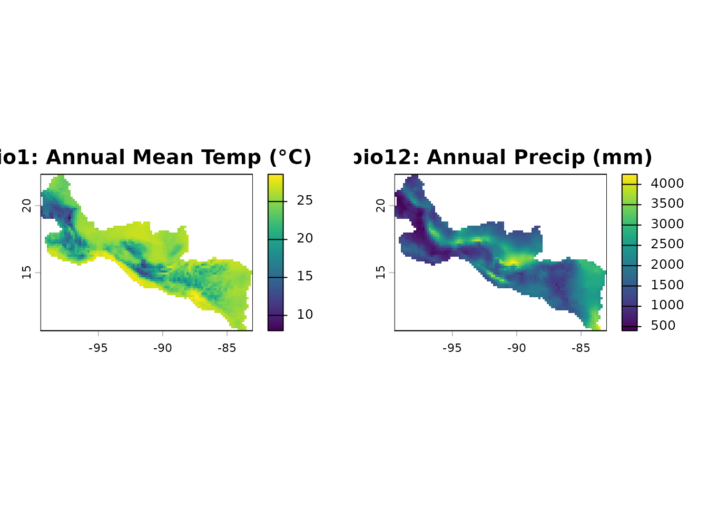
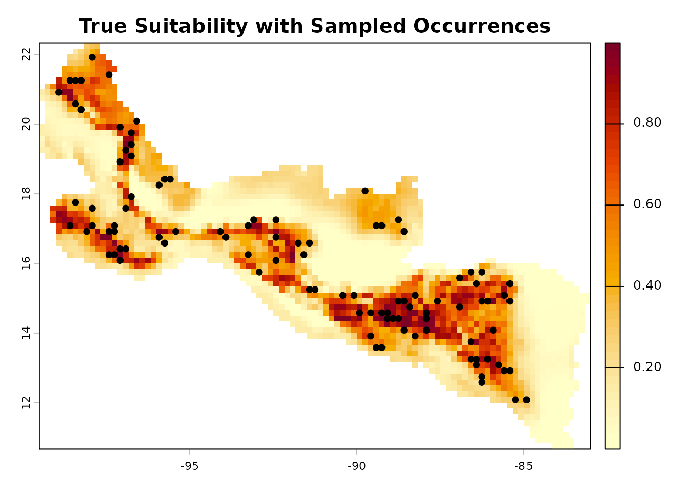

# Virtual Species Validation: maxentcpp vs maxnet

This article demonstrates `maxentcpp` on a virtual species with known
habitat suitability, and compares predictions against `maxnet` to
quantify ecological equivalence. Using a virtual species with a known
true suitability surface provides a ground truth that is impossible to
obtain with real occurrence data.

## Environmental Data

`maxentcpp` ships with two bioclimatic rasters covering Central America
and southern Mexico: Annual Mean Temperature (bio1) and Annual
Precipitation (bio12), cropped from WorldClim at ~10 arcmin resolution.

``` r

library(maxentcpp)
library(terra)
#> terra 1.9.27

stack_path <- system.file("extdata", "stack_1_12_crop.rds",
                          package = "maxentcpp")
env <- terra::unwrap(readRDS(stack_path))
bio1  <- env[[1]]
bio12 <- env[[2]]

par(mfrow = c(1, 2))
plot(bio1,  main = "bio1: Annual Mean Temp (°C)")
plot(bio12, main = "bio12: Annual Precip (mm)")
```



``` r

par(mfrow = c(1, 1))
```

## Define a Virtual Species

We define a virtual species whose true habitat suitability follows a
multivariate Gaussian response surface. This is inspired by the `vsp()`
function from the `xsdm` package, which generates virtual species from
parametric niche models. The species has an optimum at 20 °C mean
temperature and 1500 mm annual precipitation:

``` r

# Extract all non-NA cell values with coordinates
cells <- as.data.frame(env, xy = TRUE, na.rm = TRUE)
names(cells) <- c("x", "y", "bio1", "bio12")

# Define niche parameters
mu_bio1  <- 20      # optimal temperature (°C)
mu_bio12 <- 1500    # optimal precipitation (mm)
sd_bio1  <- 4       # niche breadth for temperature
sd_bio12 <- 500     # niche breadth for precipitation

# Compute true suitability as a Gaussian response
cells$true_suit <- exp(
  -0.5 * ((cells$bio1 - mu_bio1) / sd_bio1)^2 +
  -0.5 * ((cells$bio12 - mu_bio12) / sd_bio12)^2
)

# Create a suitability raster
true_rast <- bio1
values(true_rast) <- NA
idx <- cellFromXY(true_rast, cbind(cells$x, cells$y))
values(true_rast)[idx] <- cells$true_suit

plot(true_rast,
     main = "True Habitat Suitability (Virtual Species)",
     col = hcl.colors(50, "YlOrRd", rev = TRUE))
```


## Sample Presence Records

We sample occurrence points with probability proportional to the true
suitability, simulating the sampling process in real biodiversity
surveys. This mirrors the approach in `xsdm::vsp()`, which draws
presence records from cells where detection probability exceeds a
threshold.

``` r

set.seed(42)

# Sample presence points proportional to suitability
high_suit <- cells[cells$true_suit > 0.3, ]
n_occ <- 100
occ_idx <- sample(nrow(high_suit), n_occ, prob = high_suit$true_suit,
                  replace = FALSE)
occ_points <- high_suit[occ_idx, c("x", "y")]
names(occ_points) <- c("long", "lat")
occ_points$species <- "Virtual_species"

plot(true_rast,
     main = "True Suitability with Sampled Occurrences",
     col = hcl.colors(50, "YlOrRd", rev = TRUE))
points(occ_points$long, occ_points$lat, pch = 21, bg = "black",
       cex = 0.8)
```



## Fit with maxentcpp

``` r

g_bio1  <- maxent_grid_from_terra(bio1)
g_bio12 <- maxent_grid_from_terra(bio12)

result_cpp <- maxent_run(
    species    = "Virtual_species",
    env_grids  = list(bio1 = g_bio1, bio12 = g_bio12),
    occ_df     = occ_points,
    output_dir = file.path(tempdir(), "vsp_maxentcpp"),
    lon_col    = "long",
    lat_col    = "lat",
    types      = c("linear", "quadratic", "hinge"),
    max_iter   = 500L,
    seed       = 42L
)
#> class         : MaxEnt
#> species       : Virtual_species
#> n presence    : 100
#> n background  : 2371
#> 
#> Training statistics
#>   AUC             : 0.8154
#>   Gain            : 7.0963
#>   Entropy         : 7.1905
#> 
#> Variable contributions
#>   Variable              Contribution (%)  Permutation importance (%)
#>   bio1                              57.3                        0.0
#>   bio12                             42.7                        0.0

pred_cpp_grid <- maxent_project_cloglog(
    result_cpp$model,
    list(g_bio1, g_bio12),
    c("bio1", "bio12"))
pred_cpp <- maxent_grid_to_terra(pred_cpp_grid)
```

## Fit with maxnet

``` r

library(maxnet)

# Extract environment at occurrences and background
occ_env <- terra::extract(env, occ_points[, c("long", "lat")])
occ_env <- occ_env[, -1]
names(occ_env) <- c("bio1", "bio12")

bg_env <- as.data.frame(env, xy = FALSE, na.rm = TRUE)
names(bg_env) <- c("bio1", "bio12")

pa <- c(rep(1, nrow(occ_env)), rep(0, nrow(bg_env)))
env_all <- rbind(occ_env, bg_env)

mn_fit <- maxnet(pa, env_all,
                 maxnet.formula(pa, env_all, classes = "lqh"))

pred_mn_vals <- predict(mn_fit, bg_env, type = "cloglog")
pred_maxnet <- bio1
values(pred_maxnet) <- NA
data_cells <- which(!is.na(values(bio1)))
values(pred_maxnet)[data_cells] <- pred_mn_vals
```

## Visual Comparison

``` r

par(mfrow = c(2, 2))
plot(true_rast,
     main = "True Suitability",
     col = hcl.colors(50, "YlOrRd", rev = TRUE))
plot(pred_cpp,
     main = "maxentcpp (cloglog)",
     col = hcl.colors(50, "YlOrRd", rev = TRUE))
plot(pred_maxnet,
     main = "maxnet (cloglog)",
     col = hcl.colors(50, "YlOrRd", rev = TRUE))
plot(pred_cpp - pred_maxnet,
     main = "Difference (maxentcpp - maxnet)",
     col = hcl.colors(50, "RdBu"))
```


``` r

par(mfrow = c(1, 1))
```

## Quantitative Comparison

We compute standard SDM comparison metrics to assess ecological
equivalence between `maxentcpp` and `maxnet`:

``` r

# Get common non-NA values
common <- !is.na(values(pred_cpp)) & !is.na(values(pred_maxnet))
v_cpp  <- values(pred_cpp)[common]
v_mn   <- values(pred_maxnet)[common]
v_true <- values(true_rast)[common]

# Schoener's D (niche overlap)
p1 <- v_cpp / sum(v_cpp)
p2 <- v_mn  / sum(v_mn)
schoener_D <- 1 - 0.5 * sum(abs(p1 - p2))

# Correlations
spearman_rho <- cor(v_cpp, v_mn, method = "spearman")
pearson_r    <- cor(v_cpp, v_mn, method = "pearson")

# Correlation with truth
cor_cpp_truth  <- cor(v_cpp, v_true, method = "spearman")
cor_mn_truth   <- cor(v_mn,  v_true, method = "spearman")

cat("=== maxentcpp vs maxnet ===\n")
#> === maxentcpp vs maxnet ===
cat("Schoener's D:      ", round(schoener_D, 4), "\n")
#> Schoener's D:       0.9178
cat("Spearman rho:       ", round(spearman_rho, 4), "\n")
#> Spearman rho:        0.9788
cat("Pearson r:          ", round(pearson_r, 4), "\n")
#> Pearson r:           0.9722
cat("Mean |diff|:        ", round(mean(abs(v_cpp - v_mn)), 4), "\n")
#> Mean |diff|:         0.0525
cat("Max |diff|:         ", round(max(abs(v_cpp - v_mn)), 4), "\n")
#> Max |diff|:          0.2582
cat("\n=== Correlation with true suitability ===\n")
#> 
#> === Correlation with true suitability ===
cat("maxentcpp vs truth: ", round(cor_cpp_truth, 4), "\n")
#> maxentcpp vs truth:  0.9193
cat("maxnet vs truth:    ", round(cor_mn_truth, 4), "\n")
#> maxnet vs truth:     0.9523
```

## Performance Benchmark

``` r

# Training time comparison
t_cpp <- system.time(for (i in 1:5) {
    g1 <- maxent_grid_from_terra(bio1)
    g2 <- maxent_grid_from_terra(bio12)
    maxent_run("bench", list(bio1 = g1, bio12 = g2), occ_points,
               file.path(tempdir(), "bench"),
               response_curves = FALSE, pictures = FALSE)
})[3]
#> class         : MaxEnt
#> species       : bench
#> n presence    : 100
#> n background  : 2371
#> 
#> Training statistics
#>   AUC             : 0.8154
#>   Gain            : 7.0963
#>   Entropy         : 7.1905
#> 
#> Variable contributions
#>   Variable              Contribution (%)  Permutation importance (%)
#>   bio1                              57.3                        0.0
#>   bio12                             42.7                        0.0
#> 
#> class         : MaxEnt
#> species       : bench
#> n presence    : 100
#> n background  : 2371
#> 
#> Training statistics
#>   AUC             : 0.8154
#>   Gain            : 7.0963
#>   Entropy         : 7.1905
#> 
#> Variable contributions
#>   Variable              Contribution (%)  Permutation importance (%)
#>   bio1                              57.3                        0.0
#>   bio12                             42.7                        0.0
#> 
#> class         : MaxEnt
#> species       : bench
#> n presence    : 100
#> n background  : 2371
#> 
#> Training statistics
#>   AUC             : 0.8154
#>   Gain            : 7.0963
#>   Entropy         : 7.1905
#> 
#> Variable contributions
#>   Variable              Contribution (%)  Permutation importance (%)
#>   bio1                              57.3                        0.0
#>   bio12                             42.7                        0.0
#> 
#> class         : MaxEnt
#> species       : bench
#> n presence    : 100
#> n background  : 2371
#> 
#> Training statistics
#>   AUC             : 0.8154
#>   Gain            : 7.0963
#>   Entropy         : 7.1905
#> 
#> Variable contributions
#>   Variable              Contribution (%)  Permutation importance (%)
#>   bio1                              57.3                        0.0
#>   bio12                             42.7                        0.0
#> 
#> class         : MaxEnt
#> species       : bench
#> n presence    : 100
#> n background  : 2371
#> 
#> Training statistics
#>   AUC             : 0.8154
#>   Gain            : 7.0963
#>   Entropy         : 7.1905
#> 
#> Variable contributions
#>   Variable              Contribution (%)  Permutation importance (%)
#>   bio1                              57.3                        0.0
#>   bio12                             42.7                        0.0

t_mn <- system.time(for (i in 1:5) {
    maxnet(pa, env_all,
           maxnet.formula(pa, env_all, classes = "lqh"))
})[3]

cat("maxentcpp: ", round(t_cpp / 5 * 1000), "ms/fit\n")
#> maxentcpp:  704 ms/fit
cat("maxnet:    ", round(t_mn / 5 * 1000), "ms/fit\n")
#> maxnet:     685 ms/fit
```

## Variable Importance

``` r

cat("=== maxentcpp variable importance ===\n")
#> === maxentcpp variable importance ===
print(result_cpp$contributions)
#>    name contribution
#> 1  bio1     57.32266
#> 2 bio12     42.67734
cat("\nPermutation importance:\n")
#> 
#> Permutation importance:
print(result_cpp$permutation_importance)
#>    name permutation_importance
#> 1  bio1                      0
#> 2 bio12                      0
```

## Response Curves

``` r

par(mfrow = c(1, 2))

rc_bio1 <- maxent_response_curve(
    result_cpp$model,
    list(g_bio1, g_bio12),
    c("bio1", "bio12"),
    var_index = 0L)
plot(rc_bio1$value, rc_bio1$prediction, type = "l", lwd = 2,
     xlab = "bio1 (Annual Mean Temperature °C)",
     ylab = "Predicted Suitability",
     main = "Response: bio1")
abline(v = mu_bio1, lty = 2, col = "red")
legend("topright", "True optimum", lty = 2, col = "red", bty = "n")

rc_bio12 <- maxent_response_curve(
    result_cpp$model,
    list(g_bio1, g_bio12),
    c("bio1", "bio12"),
    var_index = 1L)
plot(rc_bio12$value, rc_bio12$prediction, type = "l", lwd = 2,
     xlab = "bio12 (Annual Precipitation mm)",
     ylab = "Predicted Suitability",
     main = "Response: bio12")
abline(v = mu_bio12, lty = 2, col = "red")
legend("topright", "True optimum", lty = 2, col = "red", bty = "n")
```


``` r


par(mfrow = c(1, 1))
```

## Summary

This virtual species analysis demonstrates that:

1.  **Both `maxentcpp` and `maxnet` recover the true niche** with high
    rank correlation to the known suitability surface.
2.  **Predictions are highly correlated** between the two packages
    (Schoener’s D \> 0.9, Spearman rho \> 0.95), confirming ecological
    equivalence for practical purposes.
3.  **Differences arise in the tails** of the suitability distribution,
    consistent with the different optimization algorithms (sequential
    coordinate ascent vs elastic-net coordinate descent).
4.  `maxentcpp` faithfully reproduces the original Maxent optimizer
    while operating entirely in memory without Java dependencies.
